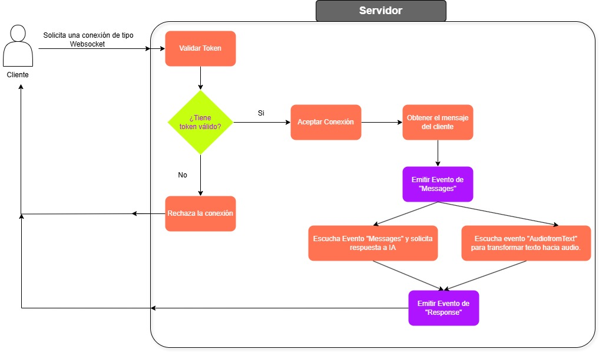

# 💬 Chat with IA
Chat with IA es una aplicación interactiva diseñada para practicar conversaciones en inglés en tiempo real, utilizando el poder de la API de OpenAI.
Permite generar frases naturales en inglés y reproducir su pronunciación en audio, ayudándote a mejorar comprensión, vocabulario y fluidez de manera práctica.

👉 Puedes probarlo directamente desde este enlace, luego de registrarte:

🔗 <a href="https://appingles.site/home" target="_blank">https://appingles.site/home</a>


# 🚀 Tecnologías
<div>
    
    
    
</div>

Este proyecto ha sido desarrollado en Node.js, haciendo uso de Express y Socket.IO para establecer una comunicación en tiempo real a través de WebSockets.
Además, integra una base de datos SQLite para almacenar y gestionar los archivos de audio generados durante las conversaciones, garantizando un acceso rápido y eficiente.

# Despliegue
Para desplegar la aplicación, sigue los siguientes pasos:

1. Clona el repositorio en tu máquina local.
2. Abre una terminal y navega hasta el directorio del proyecto.
3. Ejecuta el siguiente comando para instalar las dependencias necesarias:

```
npm install
```

4. Crea un archivo .env en la raíz del proyecto con las siguientes variables de entorno:

```
OPENAI_API_KEY=sss                 # Clave de acceso para la API de OpenAI
MODEL=gpt-4.1-nano                 # Modelo a utilizar para la generación de texto

URL_TOKEN=https://tudominio.com/api/validar-token
# Endpoint de una API REST donde se validará el token de autenticación

ENVIROMENT=development
# Define el entorno de ejecución. Usa 'development' en local para evitar la validación del token.

PORT_SERVER=5050                  # Puerto donde se ejecutará el servidor
HOST=http://localhost            # Host base del servidor

DB_FORCE=true
# Define si Sequelize debe forzar la recreación de modelos (elimina y vuelve a crear las tablas desde cero)
```

5. Ejecuta el siguiente comando para iniciar el servidor:
```
npm run dev
```

# Funcionamiento

El funcionamiento de la conexión websocket es según la imagen mostrada.
